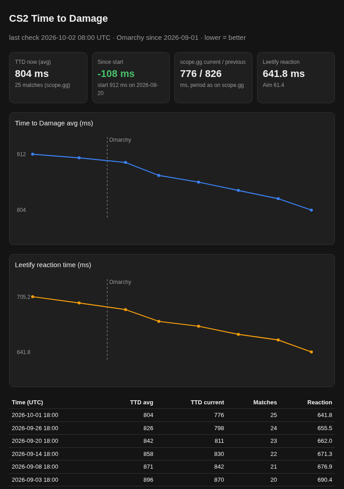

<div align="center">


# omarchy-cs2-ttd

**Your Counter-Strike 2 Time to Damage in the Omarchy bar, with trend and history.**
For [Omarchy](https://omarchy.org) / Hyprland.

[](https://omarchy.org)
[](#what-it-shows)
[](LICENSE)
[](README.de.md)



</div>

---

## What it shows

**Time to Damage (TTD)** is how long it takes from first seeing an enemy until you deal damage. Lower is better.
This widget keeps a history of it, so you can see whether you are getting faster, for example since switching to a new setup.

| | |
|---|---|
| 🎯 **Bar** | Average TTD in ms, plus the change since your first snapshot (`↓24` = 24 ms faster) |
| 📈 **Panel** | Sparkline of the trend, start value, scope.gg current / previous, fastest, Time to Kill, Leetify reaction time, last game |
| 📄 **Report** | HTML page with charts and the full history, optionally with a marked date (e.g. *Omarchy since …*) |
| 🔄 **Refresh** | Right click on the widget, or `r` / Enter in the panel |

## Install

```bash
omarchy plugin add https://github.com/vsvito420/omarchy-cs2-ttd.git --enable
~/.config/omarchy/plugins/vsvito.cs2-ttd/install.sh
```

`install.sh` asks for your **SteamID64** (17 digits, look it up on [steamid.io](https://steamid.io)) and optionally a date to mark in the charts.
It then sets up:

- the config in `~/.config/cs2-ttd/config` (only on your machine, `chmod 600`)
- a Python venv with `curl_cffi` in `~/.local/share/cs2-ttd/venv`
- the systemd user timer `cs2-ttd.timer`, which takes a snapshot every 2 hours

Remove the tracker with `install.sh --remove` and the widget with `omarchy plugin remove vsvito.cs2-ttd`.
Your config and history in `~/.local/state/cs2-ttd/` stay.

## How it works

- **Tracker:** [`tracker/tracker.py`](tracker/tracker.py) reads your public profile from `cs2tracker.gg/api/player/<steamid>`.
  The values come from scope.gg and Leetify.
  - A new line goes into `data.jsonl` only when something changed
  - It writes `widget.json` for the bar and `report.html` for the browser
  - `tracker.py show` prints the history in the terminal
- **Widget:** [`CS2TTD.qml`](CS2TTD.qml) only watches `widget.json`, so it costs nothing while you play.
  Refresh starts `cs2-ttd.service` right away.

> [!NOTE]
> cs2tracker.gg has no official API. The tracker uses the same endpoint as the website, with a Chrome-like TLS fingerprint
> (`curl_cffi`), because Cloudflare blocks plain scripts. It may stop working at any time. scope.gg only calculates
> TTD for matches it has analysed, so your profile has to be public there.

## Requirements

- Omarchy with the Quickshell based shell (bar widgets via `~/.config/omarchy/plugins/`)
- Python 3 with `venv`
- A public CS2 profile on [scope.gg](https://scope.gg) / [Leetify](https://leetify.com)

## License

[MIT](LICENSE) © 2026 vsvito420
